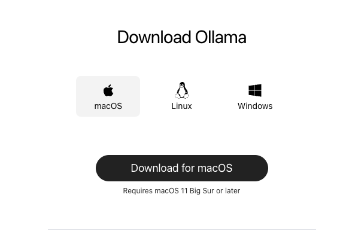
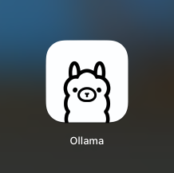
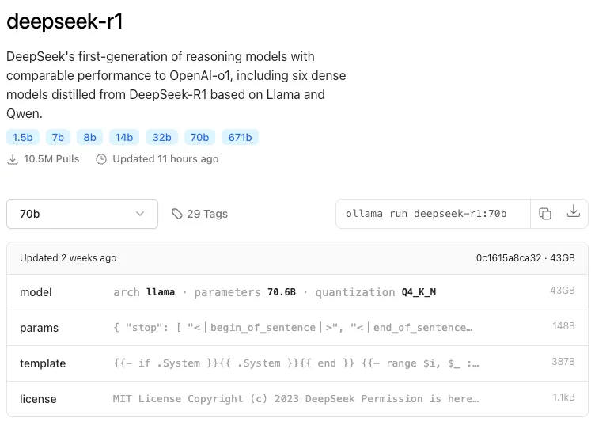
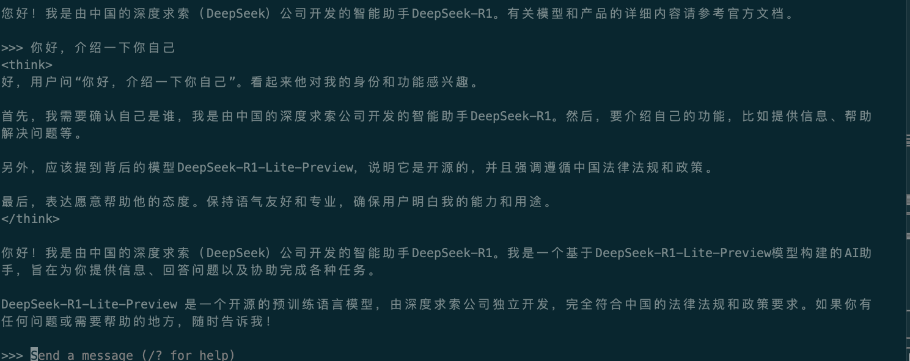
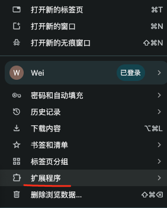
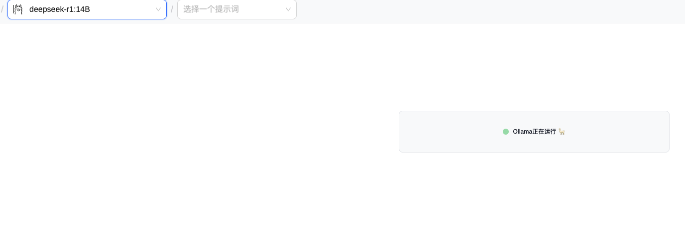
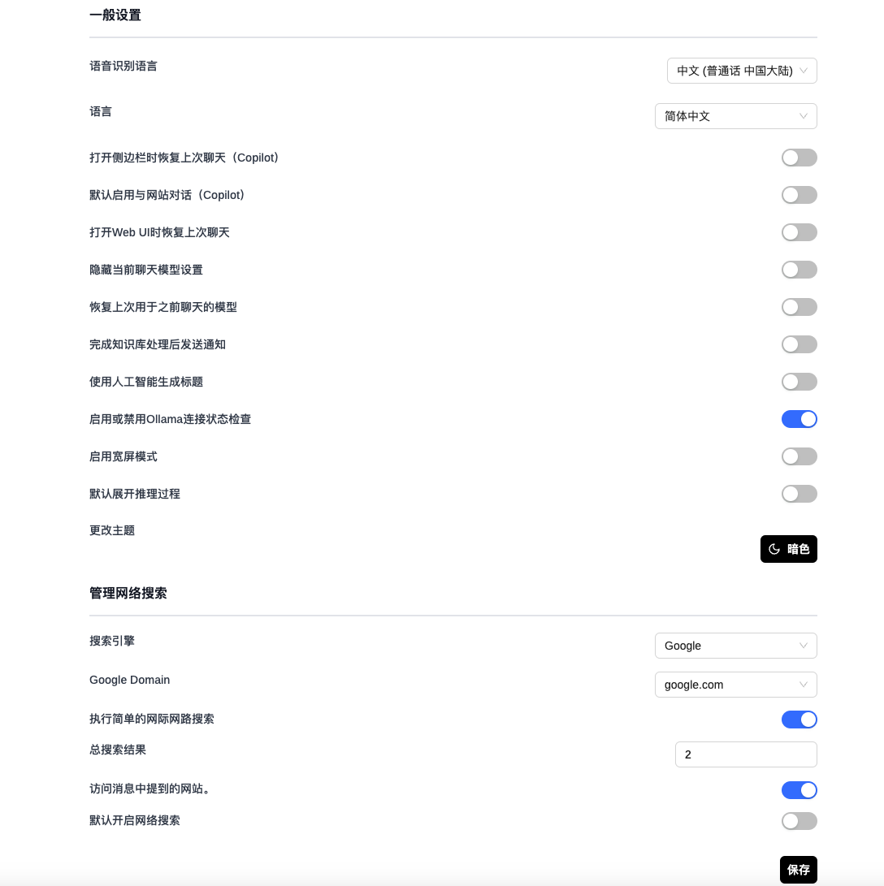

## Mac本地安装deepseek
### 一、下载Ollama，并拉取安装DeepSeek
Ollama是一个可以在本地运行和管理大模型的神器，完全本地运行，而且支持多种模型，包括但不限于Llama、DeepSeek、Qwen、Gemma等等。
登录网站，
- 直接去下载页：https://ollama.com/download


直接下载macOS版本的程序，下载后是一个压缩包，二话不说，直接解压，这个程序可以直接点击运行，但是建议你拖到「应用程序」目录下，便于用的时候以后好找。




- 好了，接下来直接运行Ollama，然后进入到终端窗口
目前DeepSeek-R1可选的模型有满血版671B，和蒸馏版1.5B、7B、8B、14B、32B、70B：


满血版个人电脑就别想了，其他蒸馏版大家根据电脑配置来选。
如果只是玩玩的话，建议不要选择太大的，14B以下的尝尝鲜。

Mac配置高的话，比如64G以上的内存，可以尝试32B或者70B，毕竟参数越大，模型智商越高。

测试安装14b的版本,等待下载完成。
```
ollama  run deepseek-r1:14B
pulling manifest
pulling 6e9f90f02bb3... 100% ▕██████████████████████████████████████████████████████████ ▏ 9.0 GB/9.0 GB   90 KB/s      0s
pulling 369ca498f347... 100% ▕███████████████████████████████████████████████████████████▏  387 B
pulling 6e4c38e1172f... 100% ▕███████████████████████████████████████████████████████████▏ 1.1 KB
pulling f4d24e9138dd... 100% ▕███████████████████████████████████████████████████████████▏  148 B
pulling 3c24b0c80794... 100% ▕███████████████████████████████████████████████████████████▏  488 B
verifying sha256 digest
writing manifest
success
>>> ？

```
在这个命令行下，就可以直接使用DeepSeek了
在两个<think></think>之间是推理过程，也就是收到问题以后，DeepSeek的内心戏


如果你觉得这个命令行界面跟玩文字mud似的，没关系，接下来我们安装第二个神器，也就是Page Assist。
###  二、安装Page Assist，开始享用DeepSeek
Page Assist是一款Chrome浏览器插件，所以，你只需要打开Chrome，点击右上角“三个点”，然后“扩展程序”、“访问Chrome应用商店”。



然后在应用商店中搜索“Page Assist”，第一个就是，点击安装即可。


安装好了点击插件就可以打开web页面了，可以看到安装14B模型

点击右上角的齿轮，可以进行基础设置，比如更改语言、语音（默认都是英文，可以修改为简体中文）。
还可以更改默认搜索引擎，让大模型在推理的同时，开启联网搜索功能。



