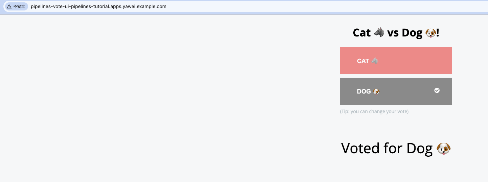
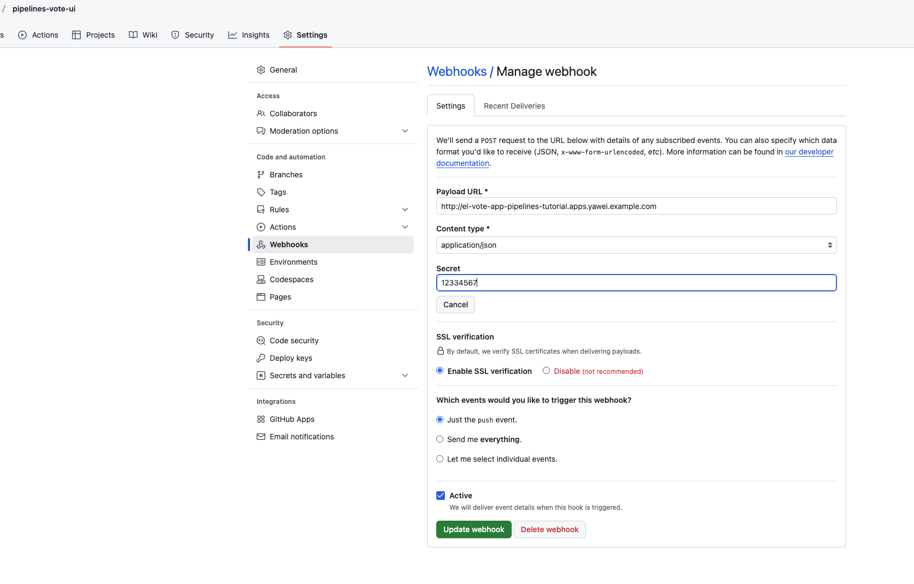

### Creating a project and checking your pipeline service account
- Log in to your OpenShift Container Platform cluster:
```
$ oc login -u <login> -p <password> https://openshift.example.com:6443
```
- Create a project for the sample application. For this example workflow, create the pipelines-tutorial project:
```
$ oc new-project pipelines-tutorial
```
- View the pipeline service account:
Red Hat OpenShift Pipelines Operator adds and configures a service account named pipeline that has sufficient permissions to build and push an image. This service account is used by the PipelineRun object.
```
oc get serviceaccount pipeline
```
### Creating pipeline tasks
- Install the apply-manifests and update-deployment task resources from the pipelines-tutorial repository, which contains a list of reusable tasks for pipelines:
```
$ oc create -f https://raw.githubusercontent.com/openshift/pipelines-tutorial/pipelines-1.17/01_pipeline/01_apply_manifest_task.yaml
$ oc create -f https://raw.githubusercontent.com/openshift/pipelines-tutorial/pipelines-1.17/01_pipeline/02_update_deployment_task.yaml
```
- Use the tkn task list command to list the tasks you created:
```
$ tkn task list
```
The output verifies that the apply-manifests and update-deployment task resources were created:
```
NAME                DESCRIPTION   AGE
apply-manifests                   3 minutes ago
update-deployment                 3 minutes ago
```
### Assembling a pipeline
A pipeline represents a CI/CD flow and is defined by the tasks to be executed. It is designed to be generic and reusable in multiple applications and environments.

A pipeline specifies how the tasks interact with each other and their order of execution using the from and runAfter parameters. It uses the workspaces field to specify one or more volumes that each task in the pipeline requires during execution.

- Create the pipeline:
```
oc create -f https://raw.githubusercontent.com/openshift/pipelines-tutorial/pipelines-1.17/01_pipeline/04_pipeline.yaml
```
- Use the tkn pipeline list command to verify that the pipeline is added to the application:
```
tkn pipeline list
NAME               AGE              LAST RUN   STARTED   DURATION   STATUS
build-and-deploy   13 minutes ago   ---        ---       ---        ---
```
### Mirroring images to run pipelines in a restricted environment

To run OpenShift Pipelines in a disconnected cluster or a cluster provisioned in a restricted environment, ensure that either the Samples Operator is configured for a restricted network, or a cluster administrator has created a cluster with a mirrored registry.

The following procedure uses the pipelines-tutorial example to create a pipeline for an application in a restricted environment using a cluster with a mirrored registry. To ensure that the pipelines-tutorial example works in a restricted environment, you must mirror the respective builder images from the mirror registry for the front-end interface, pipelines-vote-ui; back-end interface, pipelines-vote-api; and the cli.

- Mirror the builder image from the mirror registry for the front-end interface, pipelines-vote-ui.
```
$ oc describe imagestream python -n openshift
Name:			python
Namespace:		openshift
Created:		6 months ago
Labels:			samples.operator.openshift.io/managed=true
Annotations:		openshift.io/display-name=Python
			samples.operator.openshift.io/version=4.16.25
Image Repository:	image-registry.openshift-image-registry.svc:5000/openshift/python
Image Lookup:		local=false
Unique Images:		8
Tags:			10

3.11-ubi9
  tagged from registry.redhat.io/ubi9/python-311:latest
    prefer registry pullthrough when referencing this tag

```
- Mirror the supported image tag to the private registry
```
oc image mirror registry.redhat.io/ubi9/python-39:latest <mirror-registry>:<port>/ubi9/python-39
```
- Import the image:
```
oc tag <mirror-registry>:<port>/ubi9/python-39 python:latest --scheduled -n openshift
```
You must periodically re-import the image. The --scheduled flag enables automatic re-import of the image.

- Verify that the images with the given tag have been imported:
```
$ oc describe imagestream python -n openshift
Name:			python
Namespace:		openshift
[...]

latest
  updates automatically from registry  <mirror-registry>:<port>/ubi9/python-39

  *  <mirror-registry>:<port>/ubi9/python-39@sha256:3ee...

```

#####  Repeat the above steps to import golang and cli
### Running a pipeline
A PipelineRun resource starts a pipeline and ties it to the Git and image resources that should be used for the specific invocation. It automatically creates and starts the TaskRun resources for each task in the pipeline.
- Start the pipeline for the back-end application:
```
$ tkn pipeline start build-and-deploy \
    -w name=shared-workspace,volumeClaimTemplateFile=https://raw.githubusercontent.com/openshift/pipelines-tutorial/pipelines-1.17/01_pipeline/03_persistent_volume_claim.yaml \
    -p deployment-name=pipelines-vote-api \
    -p git-url=https://github.com/openshift/pipelines-vote-api.git \
    -p IMAGE='image-registry.openshift-image-registry.svc:5000/pipelines-tutorial/pipelines-vote-api' \
    --use-param-defaults

PipelineRun started: build-and-deploy-run-kzz6c

In order to track the PipelineRun progress run:
tkn pipelinerun logs build-and-deploy-run-kzz6c -f -n pipelines-tutorial
```
The previous command uses a volume claim template, which creates a persistent volume claim for the pipeline execution.
- To track the progress of the pipeline run, enter the following command::
```
$ tkn pipelinerun logs <pipelinerun_id> -f
```
The <pipelinerun_id> in the above command is the ID for the PipelineRun that was returned in the output of the previous command.
- Start the pipeline for the front-end application:
```
$ tkn pipeline start build-and-deploy \
    -w name=shared-workspace,volumeClaimTemplateFile=https://raw.githubusercontent.com/openshift/pipelines-tutorial/pipelines-1.17/01_pipeline/03_persistent_volume_claim.yaml \
    -p deployment-name=pipelines-vote-ui \
    -p git-url=https://github.com/openshift/pipelines-vote-ui.git \
    -p IMAGE='image-registry.openshift-image-registry.svc:5000/pipelines-tutorial/pipelines-vote-ui' \
    --use-param-defaults

PipelineRun started: build-and-deploy-run-94gzw

In order to track the PipelineRun progress run:
tkn pipelinerun logs build-and-deploy-run-94gzw -f -n pipelines-tutorial
```
- To track the progress of the pipeline run, enter the following command:
```
tkn pipelinerun logs build-and-deploy-run-94gzw -f -n pipelines-tutorial
```
- After a few minutes, use tkn pipelinerun list command to verify that the pipeline ran successfully by listing all the pipeline runs:
```
$ tkn pipelinerun list
NAME                         STARTED          DURATION   STATUS
build-and-deploy-run-94gzw   15 minutes ago   2m56s      Succeeded
build-and-deploy-run-kzz6c   49 minutes ago   10m1s      Succeeded
```
- Get the application route:
```
$ oc get route pipelines-vote-ui --template='http://{{.spec.host}}'
http://pipelines-vote-ui-pipelines-tutorial.apps.yawei.example.com
```


### Adding triggers to a pipeline
Triggers enable pipelines to respond to external GitHub events, such as push events and pull requests. After you assemble and start a pipeline for the application, add the TriggerBinding, TriggerTemplate, Trigger, and EventListener resources to capture the GitHub events.

- Create the TriggerBinding resource:
```
oc create -f https://raw.githubusercontent.com/openshift/pipelines-tutorial/pipelines-1.17/03_triggers/01_binding.yaml
```
- Create the TriggerTemplate resource:
```
oc create -f https://raw.githubusercontent.com/openshift/pipelines-tutorial/pipelines-1.17/03_triggers/02_template.yaml
```
- Create the Trigger resource:
```
oc create -f https://raw.githubusercontent.com/openshift/pipelines-tutorial/pipelines-1.17/03_triggers/03_trigger.yaml
```
### Creating webhooks

Webhooks are HTTP POST messages that are received by the event listeners whenever a configured event occurs in your repository. The event payload is then mapped to trigger bindings, and processed by trigger templates. The trigger templates eventually start one or more pipeline runs, leading to the creation and deployment of Kubernetes resources.

In this section, you will configure a webhook URL on your forked Git repositories pipelines-vote-ui and pipelines-vote-api. This URL points to the publicly accessible EventListener service route.

- Get the webhook URL:
  - For a secure HTTPS connection:
  ```
  $ echo "URL: $(oc  get route el-vote-app --template='https://{{.spec.host}}')"
  ```
  - For an HTTP (insecure) connection:
  ```
  echo "URL: $(oc  get route el-vote-app --template='http://{{.spec.host}}')"
  ```
- Configure webhooks manually on the front-end repository:
```
Open the front-end Git repository pipelines-vote-ui in your browser.

Click Settings → Webhooks → Add Webhook

On the Webhooks/Add Webhook page:

    - Enter the webhook URL from step 1 in Payload URL field

    - Select application/json for the Content type

    - Specify the secret in the Secret field

    - Ensure that the Just the push event is selected

    - Select Active

    - lick Add Webhook

```

### Triggering a pipeline run
Whenever a push event occurs in the Git repository, the configured webhook sends an event payload to the publicly exposed EventListener service route. The EventListener service of the application processes the payload, and passes it to the relevant TriggerBinding and TriggerTemplate resource pairs. The TriggerBinding resource extracts the parameters, and the TriggerTemplate resource uses these parameters and specifies the way the resources must be created. This may rebuild and redeploy the application.

In this section, you push an empty commit to the front-end pipelines-vote-ui repository, which then triggers the pipeline run.

- From the terminal, clone your forked Git repository pipelines-vote-ui:
```
git clone git@github.com:<your GitHub ID>/pipelines-vote-ui.git -b pipelines-1.17
```
- Push an empty commit:
```
git commit -m "empty-commit" --allow-empty && git push origin pipelines-1.17
```
- Check if the pipeline run was triggered:
```
 tkn pipelinerun list
```
