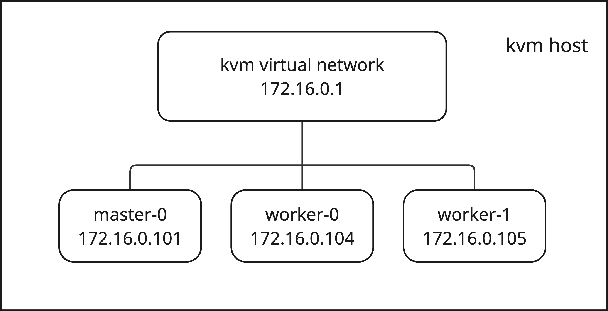

# 01 ovn-k nbdb explore

## Current Lab Environment

```bash
$ oc get nodes
NAME       STATUS   ROLES                         AGE   VERSION
master-0   Ready    control-plane,master,worker   11d   v1.31.6
worker-0   Ready    worker                        11d   v1.31.6
worker-1   Ready    worker                        11d   v1.31.6
```



## Overview of logical switches and logical routers

2 logical routers and 4 logical switches and how they are connected?

```bash
sh-5.1# ovn-nbctl lr-list
0eed137e-0bfd-46e5-aa1b-02cf9669cccd (GR_master-0)
3aa72cff-2fac-4919-98e7-65ede75535cf (ovn_cluster_router)
```

```bash
sh-5.1# ovn-nbctl ls-list
19c270b2-42ab-4148-92cc-3ef0d04a095d (ext_master-0)
d7fa3486-f5c2-4ec1-9665-1a70e5b7ae65 (join)
7decd243-3fa2-44b2-a7c7-1ab77aab5c42 (master-0)
275491c5-1c61-438d-8a2a-0a590dd57034 (transit_switch)
```

## ${Node} logical switch

First of all, let’s see ${Node} logical switch ports. This is the logical switch that Pods and ovn-k8s-mp0 will connect to.

```bash
sh-5.1# ovn-nbctl lsp-list master-0
d911ed43-cf7e-44de-84da-c9cb50c410b3 (k8s-master-0)
0d0ccf66-4ccc-4785-b7dc-4bf413235784 (openshift-apiserver-operator_openshift-apiserver-operator-df6989c8c-mkm7w)
c77b69ad-0940-4200-8440-a4eb72315273 (openshift-apiserver_apiserver-5cb67dd6b6-k74nl)
7c268d28-7d18-44da-ae24-b4e51a936e06 (openshift-authentication-operator_authentication-operator-cf8b6879-hkkw2)
44007e86-fe99-4662-a294-a3e3ec7f1c05 (openshift-authentication_oauth-openshift-7d9fd8f4d-gxqhk)
d0874b7c-3429-4d2c-9e51-c31cd7cbfe4e (openshift-catalogd_catalogd-controller-manager-685b69d46c-xzqmj)
80d3193b-3b3e-405b-a675-48c5301fc023 (openshift-cloud-credential-operator_cloud-credential-operator-5977b56b6b-49hzd)
f77c8cdb-4b83-425e-8c04-afe75e957b26 (openshift-cluster-node-tuning-operator_cluster-node-tuning-operator-7b49548584-w2ddt)
ea63d2e2-2938-4e14-be76-699fc2b32960 (openshift-cluster-olm-operator_cluster-olm-operator-677bb88fc7-lhnwg)

....
```

```bash
sh-5.1# ovn-nbctl list logical_switch_port k8s-master-0
_uuid               : d911ed43-cf7e-44de-84da-c9cb50c410b3
addresses           : ["0a:58:0a:80:00:02 10.128.0.2"]
dhcpv4_options      : []
dhcpv6_options      : []
dynamic_addresses   : []
enabled             : []
external_ids        : {}
ha_chassis_group    : []
mirror_rules        : []
name                : k8s-master-0

....
```


## ovn_cluster_router logical router

Next we see how the ovn_cluster_router logical router is connected to logical switch ${Node}

```bash
sh-5.1# ovn-nbctl list logical_switch_port stor-master-0
_uuid               : 0aa49ab0-a2b5-451d-8d21-6d7b4d46395b
addresses           : [router]
dhcpv4_options      : []
dhcpv6_options      : []
dynamic_addresses   : []
enabled             : []
external_ids        : {}
ha_chassis_group    : []
mirror_rules        : []
name                : stor-master-0
options             : {arp_proxy="0a:58:a9:fe:01:01 169.254.1.1 fe80::1 10.128.0.0/14", router-port=rtos-master-0}
parent_name         : []
port_security       : []
tag                 : []
tag_request         : []
type                : router
up                  : true
```

The above port has type=router and the options router-port=rtos-vsphere418-hvxm7-worker-0-md79q, which means its peer is rtos router port. Next we see which port does ovn_cluster_router has.

```bash
sh-5.1# ovn-nbctl lrp-list ovn_cluster_router
b4f7cf0e-3775-4081-a972-7935f760cc67 (rtoj-ovn_cluster_router)
5ab8201a-3cac-4ca2-a8cd-5068c49c95ac (rtos-master-0)
727877a7-8f96-4441-94a3-c36950f9c709 (rtots-master-0)
```

It has 3 ports and one of them is the rtos port that we previously get from logical switch ${Node}.

```bash
sh-5.1# ovn-nbctl get logical_router_port rtos-master-0 name networks
rtos-master-0
["10.128.0.1/23"]
```

```bash
sh-5.1# ovn-nbctl get logical_router_port rtoj-ovn_cluster_router name networks
rtoj-ovn_cluster_router
["100.64.0.1/16"]
```

```bash
sh-5.1# ovn-nbctl get logical_router_port rtots-master-0 name networks
rtots-master-0
["100.88.0.2/16"]
```

Then we could improve the architecture image a bit:


## join, GR_${Node} and ext_${Node}

Next we see how the rest of the logical switches and logical routers are connected, namely GR-{$Node} router and ext-${Node} logical switch quickly.

```bash
sh-5.1# ovn-nbctl lsp-list join
074c13f9-8206-4e7e-b98c-c298188c6f5a (jtor-GR_master-0)
945ebb4c-dc89-4067-b0ef-886e29ba82a1 (jtor-ovn_cluster_router)

sh-5.1# ovn-nbctl list logical_switch_port jtor-GR_master-0
_uuid               : 074c13f9-8206-4e7e-b98c-c298188c6f5a
addresses           : [router]
dhcpv4_options      : []
dhcpv6_options      : []
dynamic_addresses   : []
enabled             : []
external_ids        : {}
ha_chassis_group    : []
mirror_rules        : []
name                : jtor-GR_master-0
options             : {router-port=rtoj-GR_master-0}
parent_name         : []
port_security       : []
tag                 : []
tag_request         : []
type                : router
up                  : true
```

```bash
sh-5.1# ovn-nbctl lrp-list GR_master-0
e6531ab2-a0d4-4917-94a4-2ef1bd6a5459 (rtoe-GR_master-0)
a3fc1055-176e-4bb6-92ee-2dd16ad8bc1c (rtoj-GR_master-0)

sh-5.1# ovn-nbctl get logical_router_port rtoe-GR_master-0 name networks
rtoe-GR_master-0
["172.16.0.101/24"]

sh-5.1# ovn-nbctl get logical_router_port rtoj-GR_master-0 name networks
rtoj-GR_master-0
["100.64.0.2/16"]
```

Looking at ext_${Node} logical switch, it has etor logical switch port and a localnet type br-ex_${Node} port. A `localnet` port in OVN acts as a special gateway that connects a logical switch to a physical network. It instructs the `ovn-controller` on each node to create a patch port between the OVN integration bridge (`br-int`) and another OVS bridge that has a physical network interface as a member. This effectively "bridges" the logical and physical realms.

```bash
sh-5.1# ovn-nbctl get logical_router_port rtoj-GR_master-0 name networks
rtoj-GR_master-0
["100.64.0.2/16"]
sh-5.1# ovn-nbctl lsp-list ext_master-0
4fba8d35-e4c4-48f3-9c8f-704fd3f54723 (br-ex_master-0)
25a6737e-34ea-4a3c-b951-5ee62eb09ede (etor-GR_master-0)

sh-5.1# ovn-nbctl list logical_switch_port br-ex_master-0
_uuid               : 4fba8d35-e4c4-48f3-9c8f-704fd3f54723
addresses           : [unknown]
dhcpv4_options      : []
dhcpv6_options      : []
dynamic_addresses   : []
enabled             : []
external_ids        : {}
ha_chassis_group    : []
mirror_rules        : []
name                : br-ex_master-0
options             : {network_name=physnet}
parent_name         : []
port_security       : []
tag                 : []
tag_request         : []
type                : localnet
up                  : false
```

Then we could add join logical switch, GR and ext_${Node} logical switch to our image finally:

